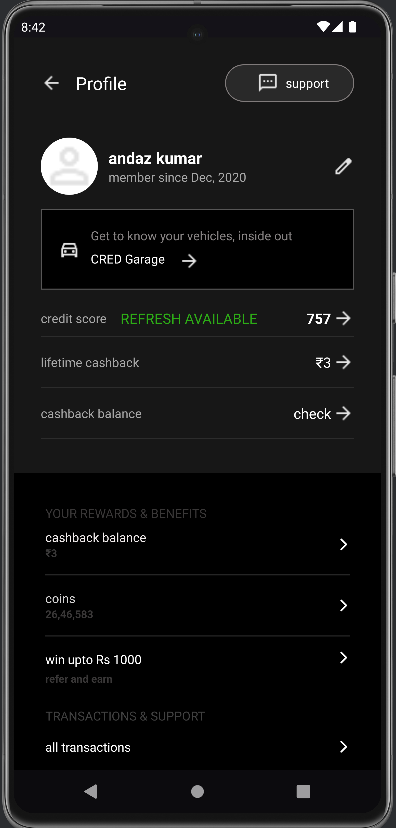

# Profile App

This is a simple Android application that demonstrates a **Profile Activity** with a UI designed to match the provided assignment requirements. 
The app uses the **MVVM (Model-View-ViewModel)** architecture and mock data to populate the profile details.

## Features
- **Profile UI**: Displays user profile information such as name and membership date.
- **Clean Architecture**: Implements MVVM architecture with a `Model`, `view`, and `ViewModel`.
- **Mock Data**: Uses hardcoded data to simulate profile information.

## Screenshots
### Profile Screen

## Project Structure
- `model/`: Contains the `UserProfile` class, which represents the user data model.
- `repository/`: Contains the `ProfileRepository` class, which provides mock data for the profile.
- `ui/profile/`: Contains the `ProfileActivity` and `ProfileViewModel` classes for the Profile screen.
- `res/layout/`: Contains the XML layout files for the UI.

